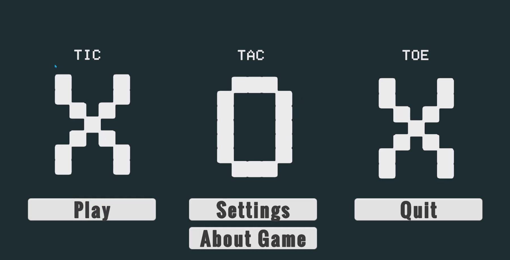

# Tic-Tac-Toe Game

A cross-platform Tic-Tac-Toe game built with Unity. Play against a friend or challenge the AI!

## 🎮 Game Features
- Player vs Player mode
- Player vs AI mode (Easy & Hard difficulty)
- Sound control with volume slider
- Settings persist between sessions
- Works on PC, Android, iOS, and WebGL

## 📁 Class Structure
Scripts/
├── AI/
│ ├── IAIStrategy.cs - Interface for AI algorithms
│ └── RuleBasedAIStrategy.cs - AI logic (Win → Block → Random)
│
├── GameLogic/
│ ├── BoardState.cs - Manages game board (no Unity dependencies)
│ ├── WinChecker.cs - Detects wins and draws
│ └── GameEvents.cs - Event system for UI updates
│
├── UI/
│ ├── GameManager.cs - Main game controller
│ ├── SettingsMenu.cs - Settings panel logic
│ ├── MainMenu.cs - Main menu navigation
│ └── ResetAllSettings.cs - Factory reset functionality
│
└── Audio/
└── AudioManager.cs - Volume control (persistent)

text

## 🤖 How AI Works

The AI uses a simple 3-step decision process:

1. **WIN** - Check if AI can win in the next move
2. **BLOCK** - Check if player can win and block them
3. **RANDOM** - If no win or block, pick a random empty cell

**Easy Mode**: Only uses step 3 (random moves)
**Hard Mode**: Uses all 3 steps (smart AI)

## 🚀 How to Run the Game

### Option 1: Play the Builds
- **PC**: Download and run the .exe file
- **Android**: Install the APK on your device
- **WebGL**: Play in browser at [Unity Play Link]

### Option 2: Run in Unity Editor

1. Open project in Unity (2020.3 or newer)
2. Open scene: `Assets/Scenes/Start Menu.unity`
3. Click Play button

### Option 3: Build Yourself

1. File → Build Settings
2. Select target platform (PC, Android, iOS, WebGL)
3. Click Build

## 🎮 How to Play

1. **Main Menu**: Choose Play to start or Settings to adjust options
2. **Game Modes**:
   - PvP: Two players take turns on same device
   - PvAI: Play against computer
3. **Gameplay**:
   - Tap/Click any empty cell to place X or O
   - First to get 3 in a row wins!
   - Press Reset to start over

## 📱 Platform Notes

| Platform | Orientation | Input |
|----------|------------|-------|
| PC | Any | Mouse Click |
| Android | Landscape | Touch |
| iOS | Landscape | Touch |
| WebGL | Any | Mouse Click |

## 🛠️ Requirements

- Unity 2020.3 or newer
- TextMeshPro (included with Unity)

---

**Made with Unity** 🎮